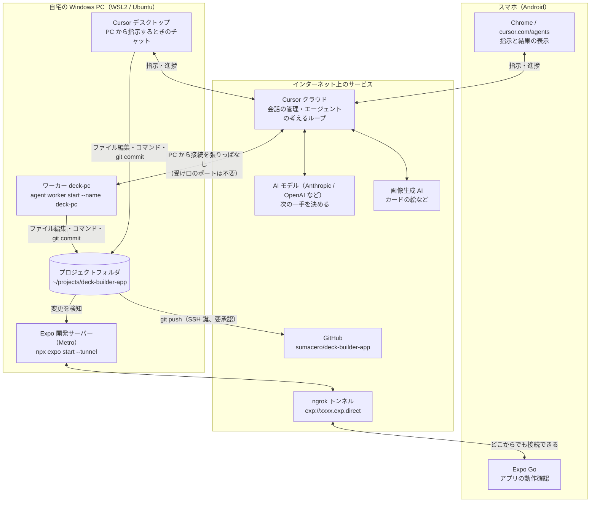
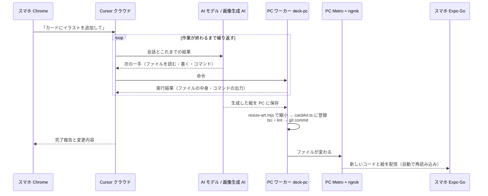

# 開発環境の全体図（PC とスマホからの AI 駆動開発・動作確認）

2026-10-06 時点。PC の Cursor からでも、スマホ（Android）の Chrome からでも AI に指示して開発し、スマホの Expo Go で動作を確認できる。

## 1. 全体の構成



- **考える役**: Cursor クラウドと AI モデル。
- **手を動かす役**: PC のワーカー（スマホから指示したとき）、または Cursor デスクトップ（PC から指示したとき）。どちらも同じプロジェクトフォルダを直接書き換える。
- **見せる役**: PC の Metro が最新のファイルを配り、ngrok 経由でスマホの Expo Go に届く。push していない変更もすぐ反映される。

## 2. スマホから「カードにイラストを追加して」と指示したときの流れ



## 3. Laravel / Web に置き換えると

| この環境 | Laravel / Web で言うと |
|---|---|
| Cursor クラウド | Web アプリ + ジョブキュー |
| ワーカー `deck-pc` | 自宅サーバーで動く `php artisan queue:work`（自分からジョブを取りに行く） |
| AI モデル | ジョブの中で呼ぶ外部 API |
| Metro + ngrok | ローカルの開発サーバーを ngrok で外部公開 |
| Expo Go | 公開された開発サーバーを開くブラウザ |

## 4. 使う前に PC で動かしておくもの

WSL のターミナルを 2 つ開き、それぞれで起動して開いたままにする（Cursor の下のターミナル欄の「＋」で増やせる。Cursor を閉じると止まるので、閉じたいときは Windows Terminal の Ubuntu で起動する）。

```bash
# 1. ワーカー（スマホからの指示を受け付ける）。「Worker is now running」と出れば OK
cd ~/projects/deck-builder-app && agent worker start --name deck-pc

# 2. Expo 開発サーバー（Expo Go で確認する）。出た QR コードを Expo Go で読む
cd ~/projects/deck-builder-app && npx expo start --tunnel
```

- PC は電源につなぐ。Windows の設定で「電源接続時はスリープしない」「カバーを閉じても何もしない」にしてある（2026-10-06 設定済み）。
- トンネルの URL は起動し直すたびに変わるので、出かける前に QR コードを読んでおく。
- 「another worker daemon is already running」と出たら、前のワーカーが残っている。`ps -eo pid,cmd | grep "worker start"` で探して止める。
- ワーカーのログに出る「Bridge connection failed, retrying」は、通信が一時的に切れて自動で再接続しているだけ。

## 5. スマホからの使い方

1. Chrome で https://cursor.com/agents を開く（メニューの「アプリをインストール」でホーム画面に置ける）。
2. 実行場所で **My Machines → deck-pc** を選ぶ（普通のクラウドを選ぶと GitHub のコードを使う別の環境になる）。
3. 日本語で指示する。作業は PC のフォルダで行われ、`AGENTS.md` のルールが使われる。
4. Expo Go で動作を確認する。

## 6. 注意点

- **PC とスマホから同時に書き換えさせない**。同じフォルダなので、変更が消えたり、相手の作りかけの変更がコミットに混ざったりする。同時に使うなら片方は読むだけにする。
- **会話は別々**。PC のチャットとスマホのチャットは履歴がつながっていない。決定事項は `docs/KNOWLEDGE.md` に残し、両方がそれを読む。スマホでの作業後は PC で「スマホでの変更を確認して」と頼む。
- **コードの中身はクラウドに送られる**。実作業は PC の中だが、AI が判断するのに必要な分のファイルの中身は Cursor と AI モデルに送られる。
- **PC かワーカーが止まると、スマホから指示しても進まない**。
- 必要なもの: Cursor の有料プラン、Cursor CLI（`~/.local/bin/agent`、`agent login` 済み）、GitHub の SSH 鍵（`~/.ssh/id_ed25519`）。
